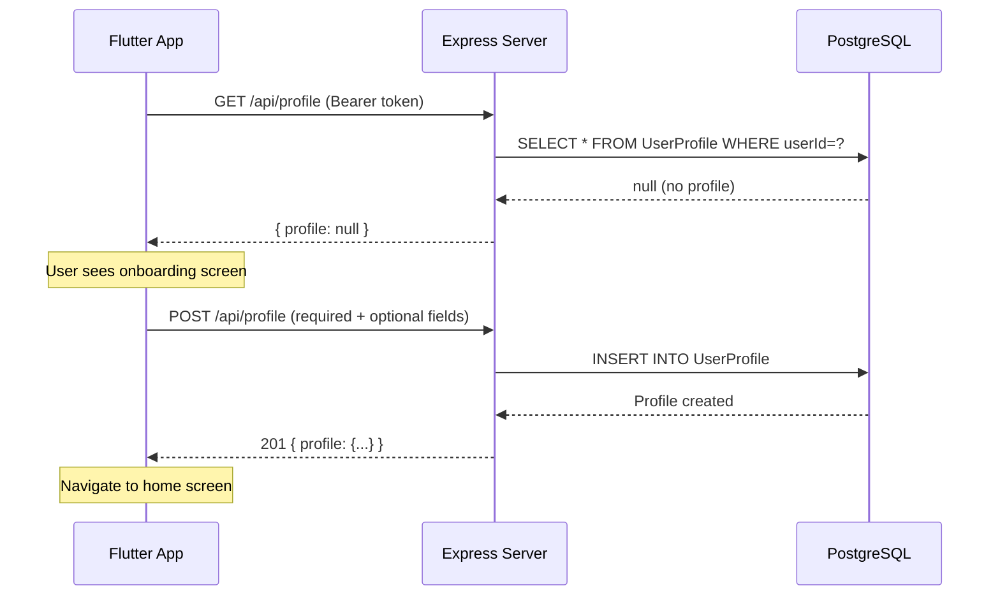
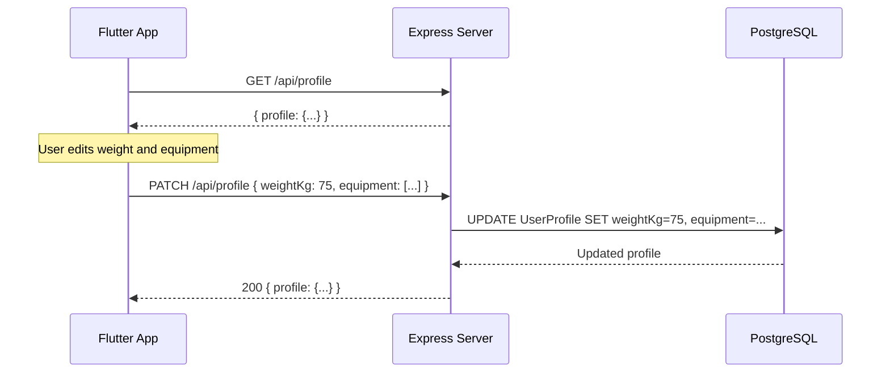
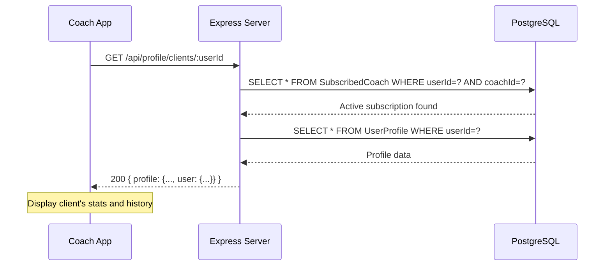

# User Profile Feature

> **Feature Status**: ✅ Fully Implemented  
> **Last Updated**: February 14, 2026

---

## Overview

The **User Profile** feature manages detailed user information beyond basic authentication data (name/nickname). It provides:

- **Onboarding flow** for first-time users to set up their fitness profile
- **Profile CRUD** operations for users to manage their personal data
- **Coach access** to view subscribed clients' profiles for personalized training

This feature is separate from the basic `User` model (which handles authentication and basic identity) and stores extended fitness-specific information like physical stats, experience level, equipment, availability, and health history.

---

## Architecture

### Database Schema

```prisma
model UserProfile {
  id        String  @id @default(cuid())
  userId    String  @unique              // 1:1 with User
  bio       String?
  avatarUrl String?

  // Personal Data
  heightCm        Float?
  weightKg        Float?
  unitPreference  String?              // "metric" | "imperial"
  sex             Sex?                 // MALE | FEMALE
  dateOfBirth     DateTime?
  equipment       String[]             // Available equipment
  injuryHistory   String?
  experienceLevel ExperienceLevel?     // BEGINNER | INTERMEDIATE | ADVANCED

  // Availability (Required)
  daysAvailable          Int            // 1-7 days per week
  sessionDurationMinutes Int            // 10-300 minutes

  createdAt DateTime @default(now())
  updatedAt DateTime @updatedAt

  user User @relation(fields: [userId], references: [id], onDelete: Cascade)
}
```

**Enums:**
- `Sex`: `MALE`, `FEMALE`
- `ExperienceLevel`: `BEGINNER`, `INTERMEDIATE`, `ADVANCED`

**Key Constraints:**
- 1:1 relationship with `User` (enforced by `@unique` on `userId`)
- `daysAvailable` and `sessionDurationMinutes` are **required** (non-nullable)
- All other fields are optional to support gradual profile completion

---

## API Endpoints

### Base Path: `/api/profile`

All endpoints follow the standard response envelope:
```typescript
interface ApiResponse<T> {
  data: T;
  errors: ApiError[];
}
```

---

### 1️⃣ Get Own Profile

**Endpoint**: `GET /api/profile`  
**Auth**: Required (`requireAppUser`)  
**Description**: Retrieve the authenticated user's profile

**Response (200 OK - Profile exists)**:
```json
{
  "data": {
    "profile": {
      "id": "clxxx123",
      "userId": "clyyy456",
      "bio": "Fitness enthusiast",
      "avatarUrl": "https://example.com/avatar.jpg",
      "heightCm": 175,
      "weightKg": 70,
      "unitPreference": "metric",
      "sex": "MALE",
      "dateOfBirth": "1990-01-15T00:00:00.000Z",
      "equipment": ["dumbbells", "resistance bands"],
      "injuryHistory": "Previous knee injury in 2020",
      "experienceLevel": "INTERMEDIATE",
      "daysAvailable": 5,
      "sessionDurationMinutes": 60,
      "createdAt": "2026-01-01T10:00:00.000Z",
      "updatedAt": "2026-02-14T08:30:00.000Z"
    }
  },
  "errors": []
}
```

**Response (200 OK - No profile yet)**:
```json
{
  "data": {
    "profile": null
  },
  "errors": []
}
```

> **Frontend Integration Tip**: Check `data.profile === null` to trigger onboarding flow

**Errors**:
- `401`: Not authenticated

---

### 2️⃣ Create Profile (Onboarding)

**Endpoint**: `POST /api/profile`  
**Auth**: Required (`requireAppUser`)  
**Description**: Create initial user profile during onboarding

**Request Body**:
```json
{
  "daysAvailable": 5,
  "sessionDurationMinutes": 60,
  "heightCm": 175,
  "weightKg": 70,
  "sex": "MALE",
  "experienceLevel": "BEGINNER",
  "equipment": ["dumbbells"],
  "unitPreference": "metric"
}
```

**Required Fields**:
- `daysAvailable` (1-7)
- `sessionDurationMinutes` (10-300)

**Optional Fields**:
- `bio` (max 2000 chars)
- `avatarUrl` (valid URL)
- `heightCm` (positive, max 300)
- `weightKg` (positive, max 700)
- `unitPreference` (string, max 20 chars)
- `sex` (`"MALE"` | `"FEMALE"`)
- `dateOfBirth` (ISO 8601 datetime with offset)
- `equipment` (array of strings, max 50 items, each max 100 chars)
- `injuryHistory` (max 5000 chars)
- `experienceLevel` (`"BEGINNER"` | `"INTERMEDIATE"` | `"ADVANCED"`)

**Response (201 Created)**:
```json
{
  "data": {
    "profile": {
      "id": "clxxx123",
      "userId": "clyyy456",
      "daysAvailable": 5,
      "sessionDurationMinutes": 60,
      // ... all profile fields
    }
  },
  "errors": []
}
```

**Errors**:
- `401`: Not authenticated
- `409`: Profile already exists (use PATCH to update)
- `400`: Validation errors (missing required fields, invalid values)

**Validation Rules**:
```typescript
daysAvailable: 1-7 (inclusive)
sessionDurationMinutes: 10-300 (inclusive)
heightCm: > 0, ≤ 300
weightKg: > 0, ≤ 700
equipment: max 50 items
bio: max 2000 characters
injuryHistory: max 5000 characters
```

---

### 3️⃣ Update Profile

**Endpoint**: `PATCH /api/profile` or `PUT /api/profile`  
**Auth**: Required (`requireAppUser`)  
**Description**: Partially update existing profile fields

**Request Body** (all fields optional):
```json
{
  "weightKg": 72,
  "experienceLevel": "INTERMEDIATE",
  "equipment": ["dumbbells", "resistance bands", "pull-up bar"]
}
```

**Nullable Fields** (can be explicitly set to `null`):
- `avatarUrl`
- `dateOfBirth`
- `injuryHistory`

**Response (200 OK)**:
```json
{
  "data": {
    "profile": {
      // ... updated profile
    }
  },
  "errors": []
}
```

**Errors**:
- `401`: Not authenticated
- `404`: Profile not found (complete onboarding first)
- `400`: Validation errors

**Notes**:
- Only provided fields are updated
- Empty body returns current profile unchanged
- Both `PATCH` and `PUT` use the same handler (partial updates)

---

### 4️⃣ Coach: Get Client Profile

**Endpoint**: `GET /api/profile/clients/:userId`  
**Auth**: Required (`requireCoach`)  
**Description**: Coach retrieves a subscribed client's profile

**Path Parameters**:
- `userId` (CUID): The client's user ID

**Response (200 OK)**:
```json
{
  "data": {
    "profile": {
      "id": "clxxx123",
      "userId": "clyyy456",
      "bio": "Looking to build muscle",
      "heightCm": 180,
      "weightKg": 75,
      "sex": "MALE",
      "experienceLevel": "BEGINNER",
      "equipment": ["dumbbells"],
      "daysAvailable": 4,
      "sessionDurationMinutes": 45,
      "user": {
        "id": "clyyy456",
        "name": "John Doe",
        "nickname": "johnd",
        "email": "john@example.com"
      },
      // ... other profile fields
    }
  },
  "errors": []
}
```

**Errors**:
- `401`: Not authenticated
- `403`: Not a coach, or user is not actively subscribed to you
- `404`: Client has not completed their profile

**Access Control**:
- Requires an active `SubscribedCoach` record (`endedAt IS NULL`)
- Returns `403` if subscription has ended
- Includes basic user info (`name`, `nickname`, `email`) for context

---

## Implementation Files

| File | Purpose |
|------|---------|
| `/src/schemas/profile.schema.ts` | Zod validation schemas |
| `/src/controllers/profile.controller.ts` | Business logic handlers |
| `/src/routes/profile.routes.ts` | Route definitions |
| `/prisma/schema.prisma` | Database schema (`UserProfile` model) |

### Key Patterns

**Controller Structure**:
```typescript
// Shared select for consistent response shape
const profileSelect = {
  id: true,
  userId: true,
  bio: true,
  // ... all fields
} as const;

export const getUserProfile = async (req: Request, res: Response): Promise<void> => {
  const profile = await prisma.userProfile.findUnique({
    where: { userId: appUser.id },
    select: profileSelect,
  });
  sendSuccess(res, { profile: profile ?? null });
};
```

**Validation Strategy**:
- `CreateUserProfileSchema`: Requires `daysAvailable` and `sessionDurationMinutes`
- `UpdateUserProfileSchema`: All fields optional, `.strict()` prevents extra fields
- `GetClientProfileSchema`: Validates `:userId` param as CUID

**Middleware Chain**:
```typescript
// User endpoints
authenticateSupabaseUser → requireAppUser → validateRequest → controller

// Coach endpoints
authenticateSupabaseUser → requireCoach → validateRequest → controller
```

---

## User Flows

### Flow 1: Onboarding (First-Time User)



### Flow 2: Profile Update



### Flow 3: Coach Views Client Profile



---

## Frontend Integration Guide

### Example: Onboarding Check

```dart
// lib/features/profile/data/profile_repository.dart
Future<Result<UserProfile?, AppError>> getProfile() async {
  final result = await apiClient.get<Map<String, dynamic>>('/profile');
  
  return result.when(
    success: (data) {
      final profile = data['profile'];
      if (profile == null) {
        return Result.success(null); // Trigger onboarding
      }
      return Result.success(UserProfile.fromJson(profile));
    },
    failure: (error) => Result.failure(error),
  );
}
```

### Example: Create Profile (Onboarding)

```dart
// lib/features/profile/presentation/providers/onboarding_provider.dart
Future<void> completeOnboarding(OnboardingData data) async {
  state = OnboardingLoading();
  
  final result = await profileRepository.createProfile(
    daysAvailable: data.daysAvailable,
    sessionDurationMinutes: data.sessionDuration,
    heightCm: data.heightCm,
    weightKg: data.weightKg,
    sex: data.sex,
    experienceLevel: data.experienceLevel,
    equipment: data.equipment,
  );
  
  result.when(
    success: (profile) {
      state = OnboardingSuccess(profile);
      // Navigate to home
    },
    failure: (error) => state = OnboardingError(error.message),
  );
}
```

### Example: Update Profile

```dart
Future<void> updateProfile({
  double? weightKg,
  List<String>? equipment,
}) async {
  final result = await apiClient.patch<Map<String, dynamic>>(
    '/profile',
    data: {
      if (weightKg != null) 'weightKg': weightKg,
      if (equipment != null) 'equipment': equipment,
    },
  );
  
  // Handle result...
}
```

---

## Design Decisions

### 1. Separate `/api/profile` Mount

**Why?** Keeps `UserProfile` concerns decoupled from `/api/user` routes (which handle `User` model fields like `name`/`nickname` and coach subscriptions).

**Alternatives Considered**:
- Mount at `/api/user/profile` → rejected to avoid confusion between `User` and `UserProfile` operations

### 2. `profile: null` on GET (Not 404)

**Why?** First-time users don't have a profile yet, but this isn't an error condition. Returning `null` lets the frontend gracefully detect and trigger onboarding without treating it as a failure.

**Response**:
```json
{ "data": { "profile": null }, "errors": [] }
```

### 3. Required Fields Only for Onboarding

**Why?** `daysAvailable` and `sessionDurationMinutes` are core to program assignment logic and must be set. All other fields are optional to reduce friction during onboarding — users can fill in additional details later via PATCH.

### 4. Nullish Update Fields

**Why?** Users should be able to **clear** optional fields (e.g., remove avatar, clear injury history). Zod's `.nullish()` allows both `null` (clear) and `undefined` (no change).

```typescript
// Schema
avatarUrl: z.string().url().nullish(),

// Update logic
if (body.avatarUrl !== undefined) {
  data.avatarUrl = body.avatarUrl ?? null;
}
```

### 5. Coach Access via Active Subscription

**Why?** Privacy protection. Coaches should only access profiles of users who are **currently** subscribed (`endedAt IS NULL`). Past clients' data is off-limits.

**Implementation**:
```typescript
const subscription = await prisma.subscribedCoach.findUnique({
  where: { userId_coachId: { userId, coachId: coach.id } },
});

if (!subscription || subscription.endedAt !== null) {
  sendSingleError(res, 'User is not subscribed to you', 403);
  return;
}
```

---

## Testing Examples

### Test: Create Profile (Happy Path)

```bash
# Setup: Login to get token
TOKEN="eyJhbGciOi..."

# Create profile
curl -X POST http://localhost:3000/api/profile \
  -H "Authorization: Bearer $TOKEN" \
  -H "Content-Type: application/json" \
  -d '{
    "daysAvailable": 5,
    "sessionDurationMinutes": 60,
    "heightCm": 180,
    "weightKg": 75,
    "sex": "MALE",
    "experienceLevel": "BEGINNER",
    "equipment": ["dumbbells", "pull-up bar"]
  }'

# Expected: 201 with profile data
```

### Test: Onboarding Detection

```bash
# Get profile before onboarding
curl http://localhost:3000/api/profile \
  -H "Authorization: Bearer $TOKEN"

# Expected: { "data": { "profile": null }, "errors": [] }
```

### Test: Update Profile (Partial)

```bash
# Update only weight and experience
curl -X PATCH http://localhost:3000/api/profile \
  -H "Authorization: Bearer $TOKEN" \
  -H "Content-Type: application/json" \
  -d '{
    "weightKg": 77,
    "experienceLevel": "INTERMEDIATE"
  }'

# Expected: 200 with updated profile (other fields unchanged)
```

### Test: Coach Access (Unauthorized)

```bash
# Coach tries to access non-subscribed user's profile
COACH_TOKEN="eyJhbGciOi..."
USER_ID="clyyy456"

curl http://localhost:3000/api/profile/clients/$USER_ID \
  -H "Authorization: Bearer $COACH_TOKEN"

# Expected: 403 { "data": null, "errors": [{ "message": "User is not subscribed to you" }] }
```

---

## Error Handling

| Scenario | Status | Response |
|----------|--------|----------|
| Profile not found (GET) | 200 | `{ profile: null }` |
| Profile already exists (POST) | 409 | `"Profile already exists. Use PATCH to update."` |
| Profile not found (PATCH) | 404 | `"Profile not found. Complete onboarding first."` |
| Missing required fields (POST) | 400 | Validation errors array |
| Invalid field values | 400 | Validation errors array |
| Coach: Not subscribed | 403 | `"User is not subscribed to you"` |
| Coach: Subscription ended | 403 | `"User is not subscribed to you"` |
| Client profile not found | 404 | `"Client has not completed their profile"` |

---

## Future Enhancements

### Potential Features

- **Profile Completion Percentage**: Calculate and return `completionPercent` based on filled optional fields
- **Profile Photos**: Add support for multiple photos (form check-ins, progress pics)
- **Measurement History**: Track weight/body measurements over time
- **Goals Tracking**: Add goal fields (target weight, target body fat %, etc.)
- **Profile Privacy Settings**: Let users control what coaches can see
- **Bulk Profile Updates**: Allow coaches to update multiple clients' profiles (e.g., batch weight entry)

---

## Related Documentation

- [User Feature](./USER.md) — Basic user management (`name`, `nickname`, coach subscriptions)
- [Coach Feature](./COACH.md) — Coach profiles and client relationships
- [Auth Feature](./AUTH.md) — Authentication and token management
- [CONTEXT.md](../CONTEXT.md) — Core patterns, middleware, response utilities

---

*Last updated: February 14, 2026*
