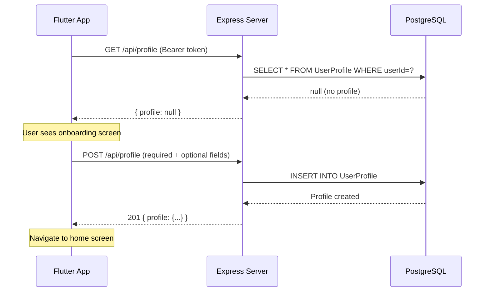
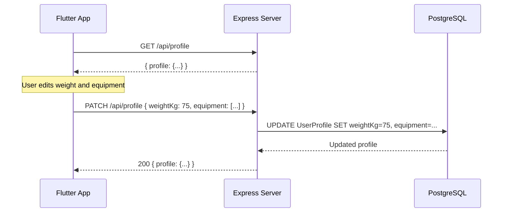
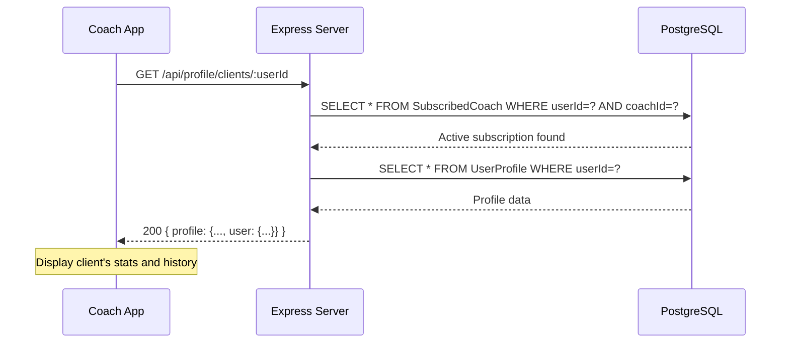

# User Profile Feature

> **Feature Status**: ✅ Fully Implemented  
> **Last Updated**: February 18, 2026

---

## Overview

The **User Profile** feature manages detailed user information beyond basic authentication data (name/nickname). It provides:

- **Onboarding flow** for first-time users to set up their fitness profile
- **Profile CRUD** operations for users to manage their personal data
- **Avatar upload** via multipart form-data with S3 storage
- **Coach access** to view subscribed clients' profiles for personalized training

This feature is separate from the basic `User` model (which handles authentication and basic identity) and stores extended fitness-specific information like physical stats, experience level, equipment, availability, and health history.

---

## Architecture

### Database Schema

```prisma
model UserProfile {
  id        String  @id @default(cuid())
  userId    String  @unique              // 1:1 with User
  bio       String?
  avatarUrl String?

  // Personal Data
  heightCm        Float?
  weightKg        Float?
  unitPreference  String?              // "metric" | "imperial"
  sex             Sex?                 // MALE | FEMALE
  dateOfBirth     DateTime?
  equipment       String[]             // Available equipment
  injuryHistory   String?
  experienceLevel ExperienceLevel?     // BEGINNER | INTERMEDIATE | ADVANCED

  // Availability (Required)
  daysAvailable          Int            // 1-7 days per week
  sessionDurationMinutes Int            // 10-300 minutes

  createdAt DateTime @default(now())
  updatedAt DateTime @updatedAt

  user User @relation(fields: [userId], references: [id], onDelete: Cascade)
}
```

**Enums:**
- `Sex`: `MALE`, `FEMALE`
- `ExperienceLevel`: `BEGINNER`, `INTERMEDIATE`, `ADVANCED`

**Key Constraints:**
- 1:1 relationship with `User` (enforced by `@unique` on `userId`)
- `daysAvailable` and `sessionDurationMinutes` are **required** (non-nullable)
- All other fields are optional to support gradual profile completion

### Avatar Storage Architecture

**S3-Compatible Object Storage** (Railway Buckets):
- `avatarUrl` column stores **S3 object keys**, not URLs (e.g., `avatars/clxxx123/1708000000.webp`)
- **Presigned URLs** are generated on-demand at read-time (1-hour TTL)
- Files uploaded via multipart/form-data → stored in memory → uploaded to S3
- Old avatars automatically deleted from S3 when replaced or removed

**Key Format**: `avatars/<userId>/<timestamp>.<ext>`

**Supported Image Types**: JPEG, PNG, WebP, HEIC, HEIF (max 5MB)

---

## API Endpoints

### Base Path: `/api/profile`

All endpoints follow the standard response envelope:
```typescript
interface ApiResponse<T> {
  data: T;
  errors: ApiError[];
}
```

---

### 1️⃣ Get Own Profile

**Endpoint**: `GET /api/profile`  
**Auth**: Required (`requireAppUser`)  
**Description**: Retrieve the authenticated user's profile

**Response (200 OK - Profile exists)**:
```json
{
  "data": {
    "profile": {
      "id": "clxxx123",
      "userId": "clyyy456",
      "bio": "Fitness enthusiast",
      "avatarUrl": "https://railway-bucket.s3.amazonaws.com/avatars/clyyy456/1708000000.webp?X-Amz-Algorithm=AWS4-HMAC-SHA256&X-Amz-Credential=...",
      "heightCm": 175,
      "weightKg": 70,
      "unitPreference": "metric",
      "sex": "MALE",
      "dateOfBirth": "1990-01-15T00:00:00.000Z",
      "equipment": ["dumbbells", "resistance bands"],
      "injuryHistory": "Previous knee injury in 2020",
      "experienceLevel": "INTERMEDIATE",
      "daysAvailable": 5,
      "sessionDurationMinutes": 60,
      "createdAt": "2026-01-01T10:00:00.000Z",
      "updatedAt": "2026-02-14T08:30:00.000Z"
    }
  },
  "errors": []
}
```

**Response (200 OK - No profile yet)**:
```json
{
  "data": {
    "profile": null
  },
  "errors": []
}
```

> **Frontend Integration Tip**: Check `data.profile === null` to trigger onboarding flow

**Errors**:
- `401`: Not authenticated

---

### 2️⃣ Create Profile (Onboarding)

**Endpoint**: `POST /api/profile`  
**Auth**: Required (`requireAppUser`)  
**Content-Type**: `multipart/form-data`  
**Description**: Create initial user profile during onboarding

**Request Body** (multipart/form-data):

> **Multipart type coercion**: All numeric fields (`heightCm`, `weightKg`,
> `daysAvailable`, `sessionDurationMinutes`) are intentionally sent as **strings**
> from mobile clients (this is standard HTTP multipart/form-data behaviour and
> avoids floating-point precision loss). The Zod schema coerces them to the
> correct types via `z.preprocess(toNumber, z.number())`. Controllers **must**
> read `res.locals.validated.body` — never `req.body` directly — to receive the
> coerced values that Prisma expects (`Float`, `Int`). Reading `req.body` would
> bypass coercion and cause a Prisma `PrismaClientValidationError`.

**Form Fields**:
```javascript
{
  "daysAvailable": "5",           // sent as string, coerced to Int
  "sessionDurationMinutes": "60", // sent as string, coerced to Int
  "heightCm": "175.0",           // sent as string, coerced to Float
  "weightKg": "70.0",            // sent as string, coerced to Float
  "sex": "MALE",
  "experienceLevel": "BEGINNER",
  "equipment": "[\"dumbbells\"]",  // JSON-encoded array as string
  "unitPreference": "metric"
}
```

**File Field** (optional):
- `avatar`: Image file (JPEG, PNG, WebP, HEIC, HEIF; max 5MB)

**Required Fields**:
- `daysAvailable` (1-7)
- `sessionDurationMinutes` (10-300)

**Optional Fields**:
- `bio` (max 2000 chars)
- `avatar` (image file, max 5MB)
- `heightCm` (positive, max 300)
- `weightKg` (positive, max 700)
- `unitPreference` (string, max 20 chars)
- `sex` (`"MALE"` | `"FEMALE"`)
- `dateOfBirth` (ISO 8601 datetime with offset)
- `equipment` (JSON array of strings, max 50 items, each max 100 chars)
- `injuryHistory` (max 5000 chars)
- `experienceLevel` (`"BEGINNER"` | `"INTERMEDIATE"` | `"ADVANCED"`)

**Response (201 Created)**:
```json
{
  "data": {
    "profile": {
      "id": "clxxx123",
      "userId": "clyyy456",
      "daysAvailable": 5,
      "sessionDurationMinutes": 60,
      // ... all profile fields
    }
  },
  "errors": []
}
```

**Errors**:
- `401`: Not authenticated
- `409`: Profile already exists (use PATCH to update)
- `400`: Validation errors (missing required fields, invalid values)
- `400`: File validation errors (file too large, invalid type)
- `500`: S3 upload failure

**Validation Rules**:
```typescript
daysAvailable: 1-7 (inclusive)
sessionDurationMinutes: 10-300 (inclusive)
heightCm: > 0, ≤ 300
weightKg: > 0, ≤ 700
equipment: max 50 items
bio: max 2000 characters
injuryHistory: max 5000 characters
avatar: max 5MB, types: [image/jpeg, image/png, image/webp, image/heic, image/heif]
```

---

### 3️⃣ Update Profile

**Endpoint**: `PATCH /api/profile` or `PUT /api/profile`  
**Auth**: Required (`requireAppUser`)  
**Content-Type**: `multipart/form-data`  
**Description**: Partially update existing profile fields

**Request Body** (multipart/form-data, all fields optional):

> **Multipart type coercion**: Same as POST — numeric fields are sent as strings
> and coerced by the Zod schema. Controllers read `res.locals.validated.body`.

**Form Fields**:
```javascript
{
  "weightKg": "72.0",            // sent as string, coerced to Float
  "daysAvailable": "4",          // sent as string, coerced to Int
  "experienceLevel": "INTERMEDIATE",
  "equipment": "[\"dumbbells\",\"resistance bands\",\"pull-up bar\"]", // JSON string
  "removeAvatar": "true"         // sent as string, coerced to boolean
}
```

**File Field** (optional):
- `avatar`: New avatar image file (replaces existing)

**Avatar Management**:
- Upload new file → replaces old avatar (old one deleted from S3)
- `removeAvatar: true` → deletes avatar without replacement
- No file + no `removeAvatar` → avatar unchanged

**Nullable Fields** (can be explicitly cleared):
- `dateOfBirth`
- `injuryHistory`

**Response (200 OK)**:
```json
{
  "data": {
    "profile": {
      // ... updated profile
    }
  },
  "errors": []
}
```

**Errors**:
- `401`: Not authenticated
- `404`: Profile not found (complete onboarding first)
- `400`: Validation errors

**Notes**:
- Only provided fields are updated
- Empty body returns current profile unchanged
- Both `PATCH` and `PUT` use the same handler (partial updates)

---

### 4️⃣ Coach: Get Client Profile

**Endpoint**: `GET /api/profile/clients/:userId`  
**Auth**: Required (`requireCoach`)  
**Description**: Coach retrieves a subscribed client's profile

**Path Parameters**:
- `userId` (CUID): The client's user ID

**Response (200 OK)**:
```json
{
  "data": {
    "profile": {
      "id": "clxxx123",
      "userId": "clyyy456",
      "bio": "Looking to build muscle",
      "heightCm": 180,
      "weightKg": 75,
      "sex": "MALE",
      "experienceLevel": "BEGINNER",
      "equipment": ["dumbbells"],
      "daysAvailable": 4,
      "sessionDurationMinutes": 45,
      "user": {
        "id": "clyyy456",
        "name": "John Doe",
        "nickname": "johnd",
        "email": "john@example.com"
      },
      // ... other profile fields
    }
  },
  "errors": []
}
```

**Errors**:
- `401`: Not authenticated
- `403`: Not a coach, or user is not actively subscribed to you
- `404`: Client has not completed their profile

**Access Control**:
- Requires an active `SubscribedCoach` record (`endedAt IS NULL`)
- Returns `403` if subscription has ended
- Includes basic user info (`name`, `nickname`, `email`) for context

---

## Implementation Files

| File | Purpose |
|------|---------|
| `/src/schemas/profile.schema.ts` | Zod validation schemas |
| `/src/controllers/profile.controller.ts` | Business logic handlers |
| `/src/routes/profile.routes.ts` | Route definitions |
| `/src/middleware/upload.middleware.ts` | Multer file upload middleware |
| `/src/services/upload.service.ts` | S3 upload/delete/presigned URL service |
| `/src/config/s3.ts` | S3 client configuration |
| `/prisma/schema.prisma` | Database schema (`UserProfile` model) |

### Key Patterns

**Controller Structure**:
```typescript
// Shared select for consistent response shape
const profileSelect = {
  id: true,
  userId: true,
  bio: true,
  avatarUrl: true,  // Stores S3 key
  // ... all fields
} as const;

// Helper: Convert S3 keys to presigned URLs
async function withSignedAvatar<T extends { avatarUrl: string | null }>(profile: T | null) {
  if (!profile) return null;
  const avatarUrl = await resolveAvatarUrl(profile.avatarUrl);  // Generates presigned URL
  return { ...profile, avatarUrl };
}

export const getUserProfile = async (req: Request, res: Response): Promise<void> => {
  const raw = await prisma.userProfile.findUnique({
    where: { userId: appUser.id },
    select: profileSelect,
  });
  const profile = await withSignedAvatar(raw);
  sendSuccess(res, { profile: profile ?? null });
};
```

**Validation Strategy**:
- `CreateUserProfileSchema`: Requires `daysAvailable` and `sessionDurationMinutes`
- `UpdateUserProfileSchema`: All fields optional, `.strict()` prevents extra fields
- `GetClientProfileSchema`: Validates `:userId` param as CUID
- All numeric fields use `z.preprocess(toNumber, z.number())` to coerce multipart strings

**Critical — always read from `res.locals.validated.body`**:
```typescript
// ✅ CORRECT — Zod-coerced types (Float, Int) ready for Prisma
const body = res.locals.validated?.body as CreateUserProfileInput;

// ❌ WRONG — raw multipart strings; Prisma throws PrismaClientValidationError
const body = req.body as CreateUserProfileInput;
```
The `validateRequest` middleware stores the fully-coerced output in
`res.locals.validated`; `req.body` is the un-transformed multer parse result
where every text field is a string.

**Middleware Chain**:
```typescript
// User endpoints (GET)
authenticateSupabaseUser → requireAppUser → controller

// User endpoints (POST/PATCH/PUT - with file upload)
authenticateSupabaseUser → requireAppUser → uploadAvatar → validateRequest → controller

// Coach endpoints
authenticateSupabaseUser → requireCoach → validateRequest → controller
```

**Upload Middleware** (`uploadAvatar`):
- Parses multipart/form-data using multer
- Extracts `avatar` file field → stored in `req.file`
- Validates file size (max 5MB) and MIME type
- Attaches file buffer to request for S3 upload in controller

---

## User Flows

### Flow 1: Onboarding (First-Time User)



### Flow 2: Profile Update



### Flow 3: Coach Views Client Profile



---

## Frontend Integration Guide

### Example: Onboarding Check

```dart
// lib/features/profile/data/profile_repository.dart
Future<Result<UserProfile?, AppError>> getProfile() async {
  final result = await apiClient.get<Map<String, dynamic>>('/profile');
  
  return result.when(
    success: (data) {
      final profile = data['profile'];
      if (profile == null) {
        return Result.success(null); // Trigger onboarding
      }
      return Result.success(UserProfile.fromJson(profile));
    },
    failure: (error) => Result.failure(error),
  );
}
```

### Example: Create Profile (Onboarding)

```dart
// lib/features/profile/presentation/providers/onboarding_provider.dart
import 'package:dio/dio.dart';

Future<void> completeOnboarding(OnboardingData data, File? avatarFile) async {
  state = OnboardingLoading();
  
  final formData = FormData.fromMap({
    'daysAvailable': data.daysAvailable.toString(),
    'sessionDurationMinutes': data.sessionDuration.toString(),
    if (data.heightCm != null) 'heightCm': data.heightCm.toString(),
    if (data.weightKg != null) 'weightKg': data.weightKg.toString(),
    if (data.sex != null) 'sex': data.sex,
    if (data.experienceLevel != null) 'experienceLevel': data.experienceLevel,
    if (data.equipment.isNotEmpty) 'equipment': jsonEncode(data.equipment),
    if (avatarFile != null) 'avatar': await MultipartFile.fromFile(
      avatarFile.path,
      filename: basename(avatarFile.path),
    ),
  });
  
  final result = await profileRepository.createProfile(formData);
  
  result.when(
    success: (profile) {
      state = OnboardingSuccess(profile);
      // Navigate to home
    },
    failure: (error) => state = OnboardingError(error.message),
  );
}
```

### Example: Update Profile with Avatar

```dart
import 'package:dio/dio.dart';

Future<void> updateProfile({
  double? weightKg,
  List<String>? equipment,
  File? newAvatar,
  bool removeAvatar = false,
}) async {
  final formData = FormData.fromMap({
    if (weightKg != null) 'weightKg': weightKg.toString(),
    if (equipment != null) 'equipment': jsonEncode(equipment),
    if (removeAvatar) 'removeAvatar': 'true',
    if (newAvatar != null) 'avatar': await MultipartFile.fromFile(
      newAvatar.path,
      filename: basename(newAvatar.path),
    ),
  });
  
  final result = await apiClient.patch<Map<String, dynamic>>(
    '/profile',
    data: formData,
  );
  
  // Handle result...
}
```

### Example: Display Avatar with Caching

```dart
import 'package:cached_network_image/cached_network_image.dart';

Widget buildAvatar(String? presignedUrl) {
  if (presignedUrl == null) {
    return CircleAvatar(child: Icon(Icons.person));
  }
  
  // Extract S3 key from presigned URL for cache key (ignore query params)
  final uri = Uri.parse(presignedUrl);
  final cacheKey = uri.path;  // e.g., "/avatars/clxxx123/1708000000.webp"
  
  return CachedNetworkImage(
    imageUrl: presignedUrl,
    cacheKey: cacheKey,  // Use S3 path as cache key, not the full URL with query params
    placeholder: (context, url) => CircularProgressIndicator(),
    errorWidget: (context, url, error) => Icon(Icons.error),
    imageBuilder: (context, imageProvider) => CircleAvatar(
      backgroundImage: imageProvider,
    ),
  );
}
```

---

## Environment Variables

**S3 Configuration** (Railway Buckets):

| Variable | Required | Description | Example |
|---|---|---|---|
| `S3_ENDPOINT` | ✅ | Railway Bucket endpoint URL | `https://your-bucket.railway.app` |
| `S3_REGION` | ❌ | AWS region | `us-east-1` (default) |
| `S3_ACCESS_KEY_ID` | ✅ | S3 access key | `AKIAxxxxxxxxxxxxxxxx` |
| `S3_SECRET_ACCESS_KEY` | ✅ | S3 secret key | `xxxxxxxxxxxxxxxxxxxxxxxx` |
| `S3_BUCKET_NAME` | ✅ | Bucket name | `get-gains-avatars` |

**Notes**:
- If S3 variables are missing, file uploads will fail with `500` errors
- Railway Buckets are S3-compatible (no public URLs → presigned URLs required)
- Set `forcePathStyle: true` for S3-compatible services

---

## Design Decisions

### 1. Separate `/api/profile` Mount

**Why?** Keeps `UserProfile` concerns decoupled from `/api/user` routes (which handle `User` model fields like `name`/`nickname` and coach subscriptions).

**Alternatives Considered**:
- Mount at `/api/user/profile` → rejected to avoid confusion between `User` and `UserProfile` operations

### 2. `profile: null` on GET (Not 404)

**Why?** First-time users don't have a profile yet, but this isn't an error condition. Returning `null` lets the frontend gracefully detect and trigger onboarding without treating it as a failure.

**Response**:
```json
{ "data": { "profile": null }, "errors": [] }
```

### 3. Required Fields Only for Onboarding

**Why?** `daysAvailable` and `sessionDurationMinutes` are core to program assignment logic and must be set. All other fields are optional to reduce friction during onboarding — users can fill in additional details later via PATCH.

### 4. Store S3 Keys, Generate Presigned URLs on Demand

**Why?** Railway Buckets (S3-compatible) don't support public URLs. Storing keys instead of URLs provides:
- **Provider-agnostic**: Migrate between S3/R2/MinIO without database changes
- **Security**: Auth middleware gates URL generation; coaches can't access non-subscribed clients
- **No expiry issues**: Keys are permanent, URLs regenerated fresh on each read
- **Simple cleanup**: Delete key from S3 when avatar changes, update DB atomically

**Implementation**:
```typescript
// Storage: avatarUrl column stores "avatars/clxxx123/1708000000.webp"
// Read-time: Generate presigned URL with 1-hour TTL
const avatarUrl = await getPresignedUrl(profile.avatarUrl);

// Update: Upload new file, delete old key from S3
const newKey = buildAvatarKey(userId, file.originalname);
await uploadFile(newKey, file.buffer, file.mimetype);
if (existing.avatarUrl) await deleteFile(existing.avatarUrl);
data.avatarUrl = newKey;
```

**Tradeoff**: ~1-2ms latency per read to sign URL (in-process HMAC, negligible)

### 5. Avatar Removal via `removeAvatar` Flag

**Why?** Multipart forms can't send `null` values. A boolean flag lets users explicitly delete their avatar without uploading a new one.

```typescript
// Schema
removeAvatar: z.boolean().optional(),

// Update logic
if (body.removeAvatar) {
  if (existing.avatarUrl) await deleteFile(existing.avatarUrl);
  data.avatarUrl = null;
}
```

### 6. Coach Access via Active Subscription

**Why?** Privacy protection. Coaches should only access profiles of users who are **currently** subscribed (`endedAt IS NULL`). Past clients' data is off-limits.

**Implementation**:
```typescript
const subscription = await prisma.subscribedCoach.findUnique({
  where: { userId_coachId: { userId, coachId: coach.id } },
});

if (!subscription || subscription.endedAt !== null) {
  sendSingleError(res, 'User is not subscribed to you', 403);
  return;
}
```

---

## Testing Examples

### Test: Create Profile (Happy Path)

```bash
# Setup: Login to get token
TOKEN="eyJhbGciOi..."

# Create profile with avatar
curl -X POST http://localhost:3000/api/profile \
  -H "Authorization: Bearer $TOKEN" \
  -F "daysAvailable=5" \
  -F "sessionDurationMinutes=60" \
  -F "heightCm=180" \
  -F "weightKg=75" \
  -F "sex=MALE" \
  -F "experienceLevel=BEGINNER" \
  -F 'equipment=["dumbbells", "pull-up bar"]' \
  -F "avatar=@/path/to/profile.jpg"

# Expected: 201 with profile data (avatarUrl contains presigned URL)
```

### Test: Onboarding Detection

```bash
# Get profile before onboarding
curl http://localhost:3000/api/profile \
  -H "Authorization: Bearer $TOKEN"

# Expected: { "data": { "profile": null }, "errors": [] }
```

### Test: Update Profile (Partial)

```bash
# Update only weight and experience
curl -X PATCH http://localhost:3000/api/profile \
  -H "Authorization: Bearer $TOKEN" \
  -F "weightKg=77" \
  -F "experienceLevel=INTERMEDIATE"

# Expected: 200 with updated profile (other fields unchanged)
```

### Test: Update Avatar

```bash
# Replace avatar with new image
curl -X PATCH http://localhost:3000/api/profile \
  -H "Authorization: Bearer $TOKEN" \
  -F "avatar=@/path/to/new-avatar.webp"

# Expected: 200 with updated profile (avatarUrl changed, old S3 key deleted)
```

### Test: Remove Avatar

```bash
# Explicitly delete avatar
curl -X PATCH http://localhost:3000/api/profile \
  -H "Authorization: Bearer $TOKEN" \
  -F "removeAvatar=true"

# Expected: 200 with profile (avatarUrl = null, S3 key deleted)
```

### Test: Coach Access (Unauthorized)

```bash
# Coach tries to access non-subscribed user's profile
COACH_TOKEN="eyJhbGciOi..."
USER_ID="clyyy456"

curl http://localhost:3000/api/profile/clients/$USER_ID \
  -H "Authorization: Bearer $COACH_TOKEN"

# Expected: 403 { "data": null, "errors": [{ "message": "User is not subscribed to you" }] }
```

---

## Error Handling

| Scenario | Status | Response |
|----------|--------|----------|
| Profile not found (GET) | 200 | `{ profile: null }` |
| Profile already exists (POST) | 409 | `"Profile already exists. Use PATCH to update."` |
| Profile not found (PATCH) | 404 | `"Profile not found. Complete onboarding first."` |
| Missing required fields (POST) | 400 | Validation errors array |
| Invalid field values | 400 | Validation errors array |
| File too large (> 5MB) | 400 | `"File too large. Maximum size is 5MB"` |
| Invalid file type | 400 | `"Invalid file type: image/svg+xml. Allowed: image/jpeg, ..."` |
| S3 upload failure | 500 | `"Failed to upload avatar image"` |
| Coach: Not subscribed | 403 | `"User is not subscribed to you"` |
| Coach: Subscription ended | 403 | `"User is not subscribed to you"` |
| Client profile not found | 404 | `"Client has not completed their profile"` |

---

## Future Enhancements

### Potential Features

- **Profile Completion Percentage**: Calculate and return `completionPercent` based on filled optional fields
- **Profile Photos**: Add support for multiple photos (form check-ins, progress pics)
- **Measurement History**: Track weight/body measurements over time
- **Goals Tracking**: Add goal fields (target weight, target body fat %, etc.)
- **Profile Privacy Settings**: Let users control what coaches can see
- **Bulk Profile Updates**: Allow coaches to update multiple clients' profiles (e.g., batch weight entry)

---

## Related Documentation

- [User Feature](./USER.md) — Basic user management (`name`, `nickname`, coach subscriptions)
- [Coach Feature](./COACH.md) — Coach profiles and client relationships
- [Auth Feature](./AUTH.md) — Authentication and token management
- [CONTEXT.md](../CONTEXT.md) — Core patterns, middleware, response utilities

---

*Last updated: February 15, 2026*
